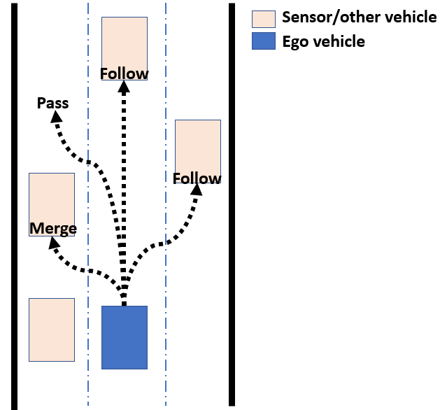
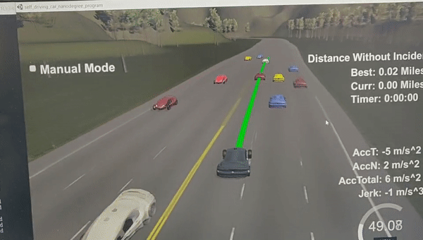

# Introduction
This is a revisit for the path planning project of the Self-Driving Car Engineer Nanodegree Program. I don't see much students actually utilizing the JMT approach for this project, mainly because of the inaccurate conversion between Cartesian and Frenet, which causes a lot bad waypoints/map offets and inconsistency of trajectory generations. After fixing the getXY function with spline tools, the JMT algorithm works much better, but there is still space to improve (like make the general map data resolution finer. Currently it has sample points about 30 meters away from each other. Shown below)   
```cpp
784.6001 1135.571 0 -0.02359831 -0.9997216
815.2679 1134.93 30.6744785308838 -0.01099479 -0.9999396
844.6398 1134.911 60.0463714599609 -0.002048373 -0.9999979
```
Since I'm not doing the project to pass the course, I won't worry about the conversion error/spikes too much. I'm just trying to realize the optimal trajectory generation [this paper](http://video.udacity-data.com.s3.amazonaws.com/topher/2017/July/595fd482_werling-optimal-trajectory-generation-for-dynamic-street-scenarios-in-a-frenet-frame/werling-optimal-trajectory-generation-for-dynamic-street-scenarios-in-a-frenet-frame.pdf), to make the vehicle able to perform good trajectory decision without the help of the behavioral layer. With just the help of 5th and 6th order degree polynomials.

# Optimal Trajectory Generation Steps

## Bellman’s Principle of Optimality
The reason why we use this method is that we want an "optimal solution" for the incoming traffic scenario. But instead of making the decision follow some behavior planner(FSM approach), we rely on the theoretical best results of a specific cost function. In other words, we generate all possible trajectories within a selected maneuver duration and pick the best feasible trajectory over time. Once the optimal solution is founded, the entire path planning shaw maintain optimal (based on the Bellman’s Principle of Optimality).
To ensure the consistency of the solution, a reasonable replan frequency has to be selected. I picked about 400ms for the step size of each new iteration, which is sufficient enough to generate 3~6 success trajectory. If the replan frequency is too low, that the car maneuver longer than the optimal solution covered time span, may result in overshoot or instability. More details about this part can be found in the paper. 

## The Starting States and End States 
To form a quintic/quartic polynomial, we need the initial state's position, velocity, and acceleration (part of the boundary conditions to solve for the trajectory coefficients). For the very first trajectory, I just used ego car's current position, velocity = 0 and acceleration = 0 for both longitudinal and lateral starting states. For end states, there will be no lateral movements(just for the sake of initializing it) and the desired ending velocity will be the speed limit with a traveling time of path horizon*0.02 (where the 0.02 is the sampling time of the simulator, and I pick the path horizon to be 250, so 5 seconds travel time in total).  The first lateral and longitudinal solution also play the role of initializing the global "best trajectory" slot.

```cpp
  // start the planing
  if(unused_plan_size == 0){
   // set intial s and d conditions
   s_BC.clear();
   s_BC.push_back(car_s);
   s_BC.push_back(0.);
   s_BC.push_back(0.);
   s_BC.push_back(speed_limit);
   s_BC.push_back(0.);


   d_BC.clear();
   d_BC.push_back(car_d);
   d_BC.push_back(0.);
   d_BC.push_back(0.);
   d_BC.push_back(car_d);
   d_BC.push_back(0.);
   d_BC.push_back(0.);

   Traj s_traj = Traj(s_BC, path_horizon*0.02);
   Traj d_traj = Traj(d_BC, path_horizon*0.02);
   double cost = lateral_w * d_traj.getCost() + longitudinal_w * s_traj.getCost();
   bestTraj = {{s_traj,d_traj},cost}; // fist init of the best traj

```
Once the ego vehicle starts running, we keep checking if the trajectory need a replan:
```cpp
  double gone_path = prev_plan_size - unused_plan_size;
  if ( gone_path >= replan_period) { 
    // replan for the states after a certain predict_horizon
    prev_plan_size = 0;
    // ego car states after timeT (predict_horizon steps after the gone)
     double timeT =(predict_horizon)*0.02 + 0.01;
     car_s = bestTraj.first.first.getDist(timeT); // timeT after now
     car_d = bestTraj.first.second.getDist(timeT);

     double car_s_speed = bestTraj.first.first.getVel(timeT);
     double car_d_speed = bestTraj.first.second.getVel(timeT);
     double car_s_accel = bestTraj.first.first.getAcel(timeT);
     double car_d_accel = bestTraj.first.second.getAcel(timeT);
    // replan based on the states at timeT
     s_BC.clear();
     d_BC.clear();
     double t_f =  (path_horizon - (gone_path+predict_horizon))*0.02; // maintain the total time to be 5 sec
```
Where the predict_horizon here works like a buffer for the selecting for new trajectory process. Once the old path reaches the replan timestamp, we need some time to replan a new one and send it to the next waypoints collector right? So instead of planning for the trajectory starting right now, we prepare for the trajectory 400ms later( I pick the predict_horizon to be 20 steps). To get the information of the car states, we use the trajectory(polynomial coefficients) we generated from the last iteration. (Details of the calculation in the trajectory.h file, all just straight forward math)

## Lateral Trajectory Generation  
We can get starting states from the last trajectory (mentioned above), and the variables we can play around is the travel duration and final lane position. So, three lane change options and an iteration loop to try different travel duration from 1.5 seconds to 4.6 sec (4.6 come from 5 sec - 0.4(replan steps) - 0.4(predict buffer), and I use 1.5 as the minimum travel time to avoid fast lane change maneuvers). Then push all resulted trajectory into the set corresponding to the lane number. The trajectory generation function is the same process for Jerk Minimize Trajectory(JMT) since we know the end location, so we have six boundary condition ready to form a quintic polynomial. The cost for each trajectory is: Integral of the jerk over time + total time spent + total distance traveled^2

```cpp
   vector<double> lanes = {2., 6., 9.5};
   vector<vector<Traj>> lateralTrajs(3);
   // the lateral variables: final lanes and durations
   for (int i=0 ; i < 3 ; i++) { // three different lanes
    // laterl durations: delta_t = 0.7
     for (double t = 1.5; t <= t_f ; t+=delta_t) { // different time durations
       d_BC = {car_d,car_d_speed,car_d_accel,lanes[i],0.0,0.0};
       Traj d_traj = Traj(d_BC, t);
       lateralTrajs[i].push_back(d_traj);
     }
   }
```
 
If you want to learn more about why using JMT and how to derive it from the Euler-Lagrange equation: [check out this](http://courses.shadmehrlab.org/Shortcourse/minimumjerk.pdf) and [jerk motion in general](https://www.emis.de/journals/BJGA/v21n1/B21-1po-b71.pdf)  
If you want to dig deeper into trajectory optimization, here is a very interesting [paper](http://www-personal.acfr.usyd.edu.au/spns/cdm/papers/Mellinger.pdf) about how to utilize snap minimizing trajectory to minimize the control effort of UAV(How to relate trajectory planning and nonlinear vehicle dynamic together) 

## Longitudinal Trajectory Generation 
There are multiple ways to select the longitudinal trajectory in the frenet frame. This part involves the interaction of vehicle surrounding (the sensor fusion part). Since we in a three lane traffic, the vehicle movement will be much natural and smooth if it adapts the ongoing traffic flow. Which will result in behavior like: no vehicle ahead(keep speed limit), follow(accelerate or decelerate), pass(accelerate) and merge(accelerate or decelerate). Then we can basically categorize them into two options: Free end with free velocity(no end-position, end-speed and travel duration as iteration variable), adapt the speed of the surrounding vehicle (known end-position, known end-speed, travel duration as iteration variable). The merge, follow or pass behavior will be the adapting different vehicle speed but different travel distance/duration, shown in the picture below:
<p align="center">
     
     <br>LongTraj_options.PNG
</p>
However, I did not use the JMT 6th degree polynomial for the longitudinal part, mainly just because of the uncertainty and wrong measurements/prediction for the sensored surrounding vehicles. So I just used a 5th-degree poly(assume not knowing the end-position), trying to follow the traffic with different time span, which also can create all merge, pass or follow behaviors, just taking more calculating power. Even the jerk is not minimum guaranteed, I still added the integral of the jerk into the cost function. So the solution should be jerk minimized as well. 

Yes using some behavior planner logic like check if the vehicle is blocked ahead or if it is good to merge or pass, or how many cars ahead, etc. will definitely help reducing the calculation time to find the feasible solution. Plus, if you do so, the same time you can get an exact desired end-position for the trajectory generation so that you can use JMT. But all of those I just mentioned requires accurate sensor data/state estimation and most importantly, a consistent controller sampling time (in this case, the simulator sampling freq). If not, then the end-position will not be accurate, and the ego vehicle will end up driving into wrong positions (collision occur when space is tight). This is the main reason why I did not use it, but this is just my own approach, and I just spent a few days on it. You can definitely try it out if you can spend some time improve the accuracy of the map resolution and Cartesian/Frenet conversion.   

```cpp
  vector<vector<Traj>> longitudinalTraj(3);
  // if the longitudinal path are free ended, we only have 5 boundary conditions,
  // the only variable to change will be the durations and final vel based on the duration
  for(int i = 0; i< 3; ++i){ // 3 lane options
    std::sort(lv[i].begin(),lv[i].end(),[](const vector<double> &a,const vector<double>&b){return a[5] > b[5];}); // compare s position
    double s_lv_t = lv[i].empty()? 0:lv[i][0][5] + sqrt(lv[i].back()[3]*lv[i].back()[3] + lv[i].back()[4]*lv[i].back()[4])*predict_horizon*0.02; // leading vehicle position at timeT
    if(lv[i].size() == 0 || s_lv_t + 5 <= car_s){ // no leading vehicle
      // change the to that lane while trying to reach to the desired speed
      // control the longitudinal duration  inbetween 1.5 - 5
      for (double t = 2; t <= t_f ; t+=delta_t) { // three different time duration
        double s_dot_t =  car_s_speed + (speed_limit - car_s_speed)*(t/t_f);
        s_BC = {car_s,car_s_speed,car_s_accel,s_dot_t,0};
        Traj s_traj = Traj(s_BC, t);
        longitudinalTraj[i].push_back(s_traj);
      }
    }else { 
       // if leading vehicles ahead in same lane , just follow it
      // if the leading vehicles at left or right lanes = lane change maybe
      // pass it or follow it or meger into it if more than one vehicle
      double vx = lv[i][0][3];
      double vy = lv[i][0][4];
      double s_lv_dot_dot = 0;
      double s_lv_dot = sqrt(vx*vx + vy*vy);
      for(double t = 2; t <= t_f ; t+=delta_t){
        //adapt speed:
        s_BC = {car_s,car_s_speed,car_s_accel,s_lv_dot,0};
        Traj s_traj = Traj(s_BC, t);
        longitudinalTraj[i].push_back(s_traj);
      }
    }
  }
```

## Longitudinal and Lateral Trajectory Combination and Collision Check
As the picture showed above, all types of vehicle behavior can be generated by combining the successor lateral and longitudinal trajectories, and find the one with the best cost, convert it into the Cartesian frame and publish it as the next waypoints.
```cpp
 for(int i = 0; i< 3; ++i){ // three lanes combination
   for(auto laTraj:lateralTrajs[i]){
     for(auto loTraj:longitudinalTraj[i]){
       // if changing lane, and d movement takes longer to finish than s movement, abandon it
      if(abs(car_d - laTraj.getDist(t_f)) > 2 && laTraj.duration > loTraj.duration) continue;
      if(!collisionCheck(loTraj,laTraj,predict_horizon,sensor_fusion)) continue;
      double cost = lateral_w * laTraj.getCost() + longitudinal_w * loTraj.getCost();
      if(cost < bestTraj.second){
        bestTraj = {{loTraj,laTraj},cost};
        cout<< "a solution found" << endl;
        //++solutionCnt;
      }
     }
   }
 }

 for (int i = 0; i < path_horizon - (predict_horizon + gone_path); i++)
 {
   //generate next points using selected trajectory with a time pace of 0.02 seconds
   double next_s = bestTraj.first.first.getDist(i*0.02);
   double next_d = bestTraj.first.second.getDist(i*0.02);
   // convert  to  global coordinates
   vector<double> sxy = getXY(next_s, next_d);

   // pass points to simulator
   next_x_vals.push_back(sxy[0]);
   next_y_vals.push_back(sxy[1]);
   prev_plan_size++;
 }
```
Note: There are some cases I will abandon the trajectory combination:
* When the lateral movement taking more time to finish than longitudinal, this will result in car moving solely horizontally after a certain point, which is not physically possible. 
* When there's collision occur (other vehicles interfere the trajectory), tested with a body box, any contact within +-3 meter in x or +- 1 meter in y will then abandon that trajectory. 
* Any trajectory with higher cost will be discarded as well.
```cpp
Here's the code for collision check:
bool collisionCheck(Traj& s_traj, Traj& d_traj, int predict_horizon, vector<vector<double>> sensor_fusion){
  double Tf = s_traj.duration; // since s movement has to >= d
  for(double t = 0; t < Tf; t+= 0.02){
    // sensor_fusion results at time t
    vector<double> ego_xy = getXY(s_traj.getDist(t),d_traj.getDist(t));
    // check the acceleration and jerk the same time
    if(abs(d_traj.getAcel(t)) > 10.0 || abs(d_traj.getJerk(t)) > 10.0 || abs(s_traj.getAcel(t)) > 10.0 || abs(s_traj.getJerk(t)) > 10.0) return false;
    for(int i = 0; i < sensor_fusion.size(); ++i){
      double near_x = sensor_fusion[i][1] + sensor_fusion[i][3] * (t + predict_horizon*0.02);
      double near_y = sensor_fusion[i][2] + sensor_fusion[i][4] * (t + predict_horizon*0.02);
      if(abs(near_x - ego_xy[0]) <= 3 && abs(near_y - ego_xy[1]) <= 1){
        return false;
      }
    }
  }
  return true;
}
```

# Other Notes
How I fix the getXY() function, instead of using linear interpolate to estimate where s,d locate in the map, directly use spline too to build the relation:
```cpp
void setupGetXY( const vector<double> &maps_x,
                 const vector<double> &maps_y,
                 const vector<double> &maps_s,
                 const vector<double> &maps_dx,
                 const vector<double> &maps_dy){


  splineX.set_points(maps_s,maps_x);
  splineY.set_points(maps_s,maps_y);
  splinedX.set_points(maps_s,maps_dx);
  splinedY.set_points(maps_s,maps_dy);

}

vector<double> getXY(double s, double d) {
  s = fmod(s, max_s);
  double x = splineX(s) + d * splinedX(s);
  double y = splineY(s) + d * splinedY(s);
  return {x,y};
}
```
Integral of jerk^2 for quintic:
 ```c++
     double jerk_int = 36*a3*a3*T + T3*(192*a4*a4 + 240*a3*a5) + 720*a5*a5*T5 + 144*a3*a4*T2 + 720*a4*a5*T4;
 ```
Integral of jerk^2 for quartic:
 ```c++
     double jerk_int = 36*a3*a3*T + 144*a3*a4*T2 + 192*a4*a4*T3;
 ```
 
 Use Eigen to solve the poly coefficients:
```cpp
MatrixXd a(3,3);
    double T2 =  T*T,
           T3 = T2*T,
           T4 = T3*T,
           T5 = T4*T;
    a <<  T3,    T4,    T5,
        3*T2,  4*T3,  5*T4,
         6*T, 12*T2, 20*T3;
    MatrixXd aInv = a.inverse();

    VectorXd b(3);
    b << BC[3] - (BC[0] + BC[1]*T + 0.5*BC[2]*T2),
         BC[4] - (           BC[1]   +     BC[2]*T),
         BC[5] - (                            BC[2]);
    VectorXd alpha = aInv * b;

    a0 = BC[0];
    a1 = BC[1];
    a2 = 0.5 * BC[2];
    a3 = alpha[0];
    a4 = alpha[1];
    a5 = alpha[2];
```
# Some DEMOs

Successfully adapt the traffcic flow:

<p align="center">
     
     <br>followTraffic.gif
</p>
Moments that bad trajectory decision got abandoned:

<p align="center">
     
     <br>abandon1.gif
</p>
<p align="center">
     
     <br>abandon2.gif
</p>
Performance in crowded traffic:

<p align="center">
     
     <br>crowdTraffic.gif
</p>
Agressive drving:

<p align="center">
     
     <br>agressiveDriving.gif
</p>

### Simulator.
You can download the Term3 Simulator which contains the Path Planning Project from the [releases tab (https://github.com/udacity/self-driving-car-sim/releases/tag/T3_v1.2).  

To run the simulator on Mac/Linux, first make the binary file executable with the following command:
```shell
sudo chmod u+x {simulator_file_name}
```

#### The map of the highway is in data/highway_map.txt
Each waypoint in the list contains  [x,y,s,dx,dy] values. x and y are the waypoint's map coordinate position, the s value is the distance along the road to get to that waypoint in meters, the dx and dy values define the unit normal vector pointing outward of the highway loop.

The highway's waypoints loop around so the frenet s value, distance along the road, goes from 0 to 6945.554.

## Basic Build Instructions

1. Clone this repo.
2. Make a build directory: `mkdir build && cd build`
3. Compile: `cmake .. && make`
4. Run it: `./path_planning`.

Here is the data provided from the Simulator to the C++ Program

#### Main car's localization Data (No Noise)

["x"] The car's x position in map coordinates

["y"] The car's y position in map coordinates

["s"] The car's s position in frenet coordinates

["d"] The car's d position in frenet coordinates

["yaw"] The car's yaw angle in the map

["speed"] The car's speed in MPH

#### Previous path data given to the Planner

//Note: Return the previous list but with processed points removed, can be a nice tool to show how far along
the path has processed since last time.

["previous_path_x"] The previous list of x points previously given to the simulator

["previous_path_y"] The previous list of y points previously given to the simulator

#### Previous path's end s and d values

["end_path_s"] The previous list's last point's frenet s value

["end_path_d"] The previous list's last point's frenet d value

#### Sensor Fusion Data, a list of all other car's attributes on the same side of the road. (No Noise)

["sensor_fusion"] A 2d vector of cars and then that car's [car's unique ID, car's x position in map coordinates, car's y position in map coordinates, car's x velocity in m/s, car's y velocity in m/s, car's s position in frenet coordinates, car's d position in frenet coordinates.

## Details

1. The car uses a perfect controller and will visit every (x,y) point it recieves in the list every .02 seconds. The units for the (x,y) points are in meters and the spacing of the points determines the speed of the car. The vector going from a point to the next point in the list dictates the angle of the car. Acceleration both in the tangential and normal directions is measured along with the jerk, the rate of change of total Acceleration. The (x,y) point paths that the planner recieves should not have a total acceleration that goes over 10 m/s^2, also the jerk should not go over 50 m/s^3. (NOTE: As this is BETA, these requirements might change. Also currently jerk is over a .02 second interval, it would probably be better to average total acceleration over 1 second and measure jerk from that.

2. There will be some latency between the simulator running and the path planner returning a path, with optimized code usually its not very long maybe just 1-3 time steps. During this delay the simulator will continue using points that it was last given, because of this its a good idea to store the last points you have used so you can have a smooth transition. previous_path_x, and previous_path_y can be helpful for this transition since they show the last points given to the simulator controller with the processed points already removed. You would either return a path that extends this previous path or make sure to create a new path that has a smooth transition with this last path.

## Tips

A really helpful resource for doing this project and creating smooth trajectories was using http://kluge.in-chemnitz.de/opensource/spline/, the spline function is in a single hearder file is really easy to use.

---

## Dependencies

* cmake >= 3.5
  * All OSes: [click here for installation instructions](https://cmake.org/install/)
* make >= 4.1
  * Linux: make is installed by default on most Linux distros
  * Mac: [install Xcode command line tools to get make](https://developer.apple.com/xcode/features/)
  * Windows: [Click here for installation instructions](http://gnuwin32.sourceforge.net/packages/make.htm)
* gcc/g++ >= 5.4
  * Linux: gcc / g++ is installed by default on most Linux distros
  * Mac: same deal as make - [install Xcode command line tools]((https://developer.apple.com/xcode/features/)
  * Windows: recommend using [MinGW](http://www.mingw.org/)
* [uWebSockets](https://github.com/uWebSockets/uWebSockets)
  * Run either `install-mac.sh` or `install-ubuntu.sh`.
  * If you install from source, checkout to commit `e94b6e1`, i.e.
    ```
    git clone https://github.com/uWebSockets/uWebSockets
    cd uWebSockets
    git checkout e94b6e1
    ```

